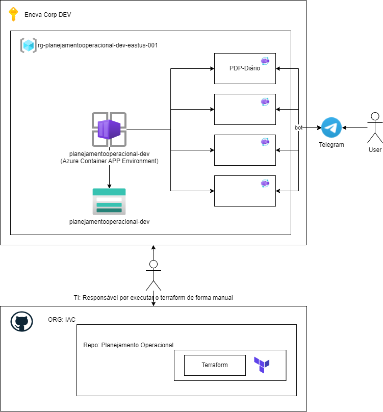

# Planejamento-Operacional
Organização criada para armazenar/gerenciar os projetos da área de "Planejamento-Operacional" da Eneva.

O ambiente produtivo será equivalente ao ambiente de *desenvolvimento* porém na subscription de *produção* e com o nomes dos recursos com **"PRD"** ao invés de **"DEV"**.